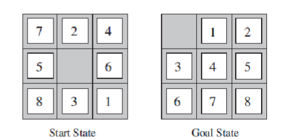

## Table of Contents

- Introduction
- Problem Description
- Solution
- Results
- Conclusion

## Introduction

The content in this repo is for a school assignment on AI algorithms.
The purpose is to understand various algorithms including uninformed and informed (heuristic) methods.


## Problem Description 
For this assignment, the problem is that of a sliding-tile puzzle game.
This is a squared grid/board composed of n<sup>2</sup> tiles. The tiles contain numbers from 1 to (n<sup>2</sup> -1).
One tile is empty. The puzzle has a Goal state, which is the state we want to reach. This state could be one where 
all tiles on the board are in order, from left to right, top to bottom as seen in Figure 1. The puzzle starts with the 
board at the Start state, which is a state other than the Goal state as seen in Figure 1. We begin at the Start state
and aim to reach the Goal state by sliding the tiles around using the empty space.

_Figure 1_



The problem is to solve the puzzle using different uniformed and informed algorithmic approaches.


## Solution

### Design 

I created different classes to break down the program.
- Main Class
  - Creates JsonParser object to get file data.
  - Calls dfs(), iterativeDFS(), graphSearch(), aStar()
- JsonParser Class
  - Reads input json file and retrieves the data associated for the board
  - Checks validity of data.
- Board Class
  - Contains the Board data ( goal, currentBoard, nodesExamined, solutionPath, depthCount)
  - Contains functions to check/get Rules and make Moves on the board.
- Node Class
  - A class to create Nodes for a graph search. 
  - Contains a Board class to keep board data for each node.
  - Contains function to create adjacent boards by leveraging the Board class functions.

The first thing to do is to open a json file and retrieve the data. Then we want to check the validity of the data.

The following must be True:
- The file must exist in the directory
- Json file contains keys: ```n, start, goal```
- value of n > 1
- Check that the values in both ```start``` and ```goal``` contain all numbers from 0 to (n-1)
  - This also ensures the board is the right size (n*n)

For that I implemented the JsonParser class as seen below:
```java
public class JsonParser {
    public List<Integer> goal = new ArrayList<>();
    public List<Integer> start = new ArrayList<>();
    public long n;
    public boolean validKeys = false;
    public boolean validValues = false;
    
    public void importFile(String filePath) {
        Object obj = null;
        try {
            obj = new JSONParser().parse(new FileReader(filePath));
        } catch (FileNotFoundException e) {
            System.out.println("An error occurred.File not found");
            return;
        } catch (IOException | ParseException e) {
            throw new RuntimeException(e);
        }
        JSONObject jo = (JSONObject) obj;
        validKeys = checkKeys(jo);
        getValues(jo);
        validValues = checkValues(jo);
    }

    private void getValues(JSONObject jo){
        n = (long) jo.get("n");
        getPuzzleBoards(start, "start", jo);
        getPuzzleBoards(goal, "goal", jo);
    }
    private void getPuzzleBoards(List<Integer> board, String boardName, JSONObject jo){
        JSONArray list = (JSONArray) jo.get(boardName);
        for (Object o : list) {
            JSONArray m = (JSONArray) o;
            for (Object val : m) {
                Long i = (Long) val;
                board.add(i.intValue());
            }
        }
    }

    private boolean checkKeys(JSONObject jo){
        return jo.containsKey("n") || jo.containsKey("start") || jo.containsKey("goal");
    }
    private boolean checkValues(JSONObject jo){
        if (n < 2 || goal.size() != n*n || start.size() != n*n){
            return false;
        }
        for (int i = 0; i < n ; i++){
            if(!start.contains(i) || !goal.contains(i)){
                return false;
            }
        }
        return true;
    }
}
```


Next was to create a Board class.
I could have created different Board classes for each to fit the specific needs of each Algorithm(class extends class), but instead I created
one Board class that fits the needs of the Algorithms. Some functions and members were not required for some algorithms.

What I needed in the Board class for all Algorithms:
- Be able to set Goal and Current boards.
- It would keep the Rules in this class to check against them.
- It would need functions to retrieve valid moves, make moves, undo moves (to get prev state).
- Get current board.
- Check if current state of board matches the goal board.
- Print current board.

Specifically for the Backtracking and BacktrackingIterative algorithms:
- Keep track of _visited_ board states.
- Check if board states have been _visited_.

I added a couple of members for convenience as well.

This is what the Board class looks like:

```java
public class Board {

    private final HashMap<List<Integer>, Integer> visitedBoards = new HashMap<>();
    private final String UP = "up";
    private final String DOWN = "down";
    private final String LEFT = "left";
    private final String RIGHT = "right";
    private List<Integer> goal;
    private List<Integer> currentBoard;
    int n;
    Integer nodesExamined = 0;
    Stack<String> solutionMoves = new Stack<>();
    Integer depthCount = 26;
    int count = 0;

    public boolean boardsMatch(){
        return currentBoard.equals(goal);
    }
    public void setBoards(List<Integer> goalBoard, List<Integer> startBoard){
        goal = goalBoard;
        currentBoard = startBoard;
    }

    public void setCurrentBoard(List<Integer> board){
        currentBoard = board;
    }
    public void printBoards(){
        printBoard(currentBoard, "Start");
        printBoard(goal, "Goal");
    }

    private void printBoard(List<Integer> board, String name){
        System.out.println("\n" + name + ":");
        for (int i = 0; i < board.size(); i++){
            if( i % n == 0 && i != 0){
                System.out.println();
            }
            System.out.print(board.get(i) + " ");
        }
        System.out.println();
    }

    public void makeMove(String move){
        int indexOfZero = currentBoard.indexOf(0);

        if (Objects.equals(move, UP)){
            currentBoard.set(indexOfZero, currentBoard.get(indexOfZero - n));
            currentBoard.set(indexOfZero-n, 0);
        } else if (Objects.equals(move, DOWN)) {
            currentBoard.set(indexOfZero, currentBoard.get(indexOfZero + n));
            currentBoard.set(indexOfZero+n, 0);
        } else if (Objects.equals(move, RIGHT)) {
            currentBoard.set(indexOfZero, currentBoard.get(indexOfZero+1));
            currentBoard.set(indexOfZero+1, 0);
        } else if (Objects.equals(move, LEFT)){
            currentBoard.set(indexOfZero, currentBoard.get(indexOfZero-1));
            currentBoard.set(indexOfZero-1, 0);
        }
    }

    public void undoMove(String move){
        if (Objects.equals(move, UP)){
            makeMove(DOWN);
        } else if (Objects.equals(move, DOWN)) {
            makeMove(UP);
        } else if (Objects.equals(move, RIGHT)) {
            makeMove(LEFT);
        } else if (Objects.equals(move, LEFT)){
            makeMove(RIGHT);
        }
    }

    /***
     * Rules to check against
     * @param prevMove -
     * @return validMoves - List<String>
     */
    public List<String> getMovesList(String prevMove){
        List<String> validMoves = new ArrayList<>();
        int indexOfZero = currentBoard.indexOf(0);

        if (!Objects.equals(prevMove, RIGHT) && indexOfZero % n > 0 ){
            validMoves.add(LEFT);
        }
        if (!Objects.equals(prevMove, LEFT) && indexOfZero % n < n-1){
            validMoves.add(RIGHT);
        }
        if (!Objects.equals(prevMove, DOWN) && indexOfZero >= n){
            validMoves.add(UP);
        }
        if (!Objects.equals(prevMove, UP) && indexOfZero < currentBoard.size() - n){
            validMoves.add(DOWN);
        }
        return validMoves;
    }

    /***
     * To keep track of boards that have
     * been visited
     * @return bool
     */
    public boolean visited(){
        return (visitedBoards.containsKey(currentBoard) && visitedBoards.get(currentBoard) < count);
    }

    public void addToVisitedBoards(){
        visitedBoards.put(currentBoard, count);
    }

    public List<Integer> getCurrentBoard(){
        return currentBoard;
    }

    public List<Integer> getGoal(){
        return goal;
    }
}
```

Now to the backtracking algorithm. This is a recursive algorithm.

Backtrack(currentState):
- If the current state has not been _visited_
    - it adds it to a _visited_ list to avoid clone states
- Else, returns false (already visited this state, don't want to revisit)
- Checks if currentState matches the goals state.
  - If true, 
    - adds the rule/move to a stack
    - returns true (backtracking here, goes all the way back to initial call fo Backtrack())
- Else, checks which rules apply to the current state and gets new states.
- For each newState:
    - if(Backtracking(newState)):   **Recursion here..** ***If that state is a match..***
      - return True **Backtracking continues here..**
  - Else, it skips over this state as it has already been visited.
- Return false if no child state matches.

I also wanted to keep a bound limit to avoid exceeding the recursion limit. This would be the depthCount and would be checked against.

The function is as follows:
```java
    private static Boolean backtrackingDFS(Board dfsBoard, String prevMove){
        if (dfsBoard.visited()){
            return false;
        }
        else {
            dfsBoard.addToVisitedBoards();
        }
        dfsBoard.nodesExamined += 1;
        if (dfsBoard.count > dfsBoard.depthCount){
            return false;
        }
        if (dfsBoard.boardsMatch()){
            System.out.println("Solution Length = " + dfsBoard.count);
            return true;
        }
        List<String> movesList = dfsBoard.getMovesList(prevMove);
        for (String move : movesList){
            dfsBoard.makeMove(move);
            dfsBoard.count +=1;
            if (backtrackingDFS(dfsBoard, move)) {
                dfsBoard.solutionMoves.push(move);
                return true;
            }
            dfsBoard.undoMove(move);
            dfsBoard.count -=1;
        }
        return false;
    }
```

For the iterative Backtracking Algorithms, I decided to use the same Backtracking function but start with the depthCount as 0
then increase each time until the solution was found. This allowed me to use the bound limit for the iterative solution.

This would be:
- goalFound = false
- board = new Board();
- board.depthCount = 0;
- While (!goalFound)
  - goalFound = Backtracking(board)
  - board.depthCount += 1

```java
private static void iterativeDFS(JsonParser data){
        long timeStart = System.currentTimeMillis();
        Board itBoard = new Board();
        itBoard.setBoards(new ArrayList<>(data.goal), new ArrayList<>(data.start));
        itBoard.printBoards();
        itBoard.n = (int) data.n;
        itBoard.depthCount = 0;
        itBoard.nodesExamined = 1;
        boolean solutionFound = false;
        while(!solutionFound){
            System.out.println(itBoard.depthCount + ": Cumulative nodes-examined = " + itBoard.nodesExamined);
            solutionFound = backtrackingDFS(itBoard, "");
            itBoard.depthCount += 1;
        }
        timer(timeStart, System.currentTimeMillis());
        while (!itBoard.solutionMoves.empty()){
            System.out.println(itBoard.solutionMoves.pop());
        }
    }
```

For the graph search, it required a Node class.
This would house a Board class, successorBoards (new States), and parent Node.
It would need a constructor suited for the graph search and need a function to create successor nodes (new states);

```java

public class Node {
    Board board = new Board();
    List<Node> successorBoards = new ArrayList<>();
    String prevMove;
    Node parentNode;

    public Node(List<Integer> newBoard, String move, Node prevNode){
        board.setCurrentBoard(newBoard);
        prevMove = move;
        parentNode = prevNode;
    }

    public void createSuccessors(List<Node> open, List<Node> closed){
        List<String> moves = board.getMovesList(prevMove);
        for (String move : moves){
            board.makeMove(move);
            List<Integer> temp = new ArrayList<>(board.getCurrentBoard());
            board.undoMove(move);
            boolean alreadyClosed = false;
            boolean alreadyOpened = false;
            for(Node node : closed){
                if (node.board.getCurrentBoard().equals(temp)){
                    alreadyClosed = true;
                    break;
                }
            }
            for(Node node : open){
                if (node.board.getCurrentBoard().equals(temp)){
                    alreadyOpened = true;
                    break;
                }
            }
            if (!alreadyClosed && !alreadyOpened){
                successorBoards.add(new Node(temp, move, this));
            }
        }
    }
}
```

From the assignment, a Graph Search algorithm follows:
1.  Create a search graph, G, consisting solely of the start node, s. Put s on a list called OPEN.
2.  Create a list called CLOSED that is initially empty.
3.  LOOP: if OPEN is empty, exit with failure.
4. Select the first node on OPEN, remove it from OPEN, and put it on CLOSED. Call this node n.
5. if n is a goal node. Exit successfully with the solution obtained by tracing a path along the
   pointers from n to s in G. (Pointers are established in step 7.)
6. Expand node n, generating a set, M, of its successors and install them as successors of n in G.
7. Establish a pointer to n from those members of M that were not already in G (i.e., not already
   on either OPEN or CLOSED). Add these members of M to OPEN. For each member of M that
   is already on OPEN or CLOSED, decide whether or not to redirect its pointer to n. For each
   member of M already on CLOSED, decide for each of its descendents in G whether or not to
   redirect its pointer.
   8 Reorder the list OPEN, either according to some arbitrary scheme or according to heuristic
   merit.
   9 Go LOOP

To follow that, I created the following function, leveraging Node and Board class.
```java
    private static void graphSearch(List<Integer> goal, List<Integer> start){
        long timeStart = System.currentTimeMillis();
        System.out.println("\n\nGraph Search");
        List<Node> open = new ArrayList<>();
        List<Node> closed = new ArrayList<>();
        open.add(new Node(start, "", null));
        int nodesExamined = 0;
        int nodesGenerated = 0;
        while(!open.isEmpty()){
            if(open.get(0).board.getCurrentBoard().equals(goal)){
                System.out.println("Nodes gerenated : " + nodesGenerated);
                System.out.println("Nodes examined : " + nodesExamined);
                timer(timeStart, System.currentTimeMillis());
                printPath(open.get(0));
                break;
            }
            closed.add(open.get(0));
            open.get(0).createSuccessors(open, closed);
            open.addAll(open.get(0).successorBoards);
            nodesGenerated += open.get(0).successorBoards.size();
            open.remove(0);
            if(nodesExamined > 600000){
                break;
            }
            nodesExamined += 1;
        }
    }
```

The A* (A Start) algorithm was to implement the graph search & nodes from the Graph Search algorithm.
The main difference is that the A Star aglorithm uses heursitics to weigh the distance to the solution for each board state.
In this case, the 2 heuristics used were:
- h1 - the number of misplaced tiles of current board
- h2 - the sum of the distances of the tiles from their goal position(i.e. Manhattan Distance)

So, the steps to interject were:
1. Get the heuristic values;
2. Sort Open list by heuristic values on each loop;

I had to add a function in Node class to calculate the Heuristic Values:

```java
public class Node {
    ...

    public void heuristics() {
        for (Integer a : board.getCurrentBoard()) {
            int currentPos = board.getCurrentBoard().indexOf(a);
            int goalPos = board.getGoal().indexOf(a);
            if (currentPos == goalPos) {
                tilesMatched += 1;
            } else {
                int xDiff = Math.abs((currentPos % board.n) - (goalPos % board.n));
                int yDiff = Math.abs((currentPos / board.n) - (goalPos / board.n));
                manhattanDistance += (xDiff + yDiff);
            }
            hn = tilesMatched + manhattanDistance;

        }
    }
}
```
I also needed to add a new class to Sort the OPEN list by heuristic value:

```java
public class SortNodes implements Comparator<Node> {
    public int compare(Node a, Node b){
        return a.hn - b.hn;
    }
}
```
That gives me the following function:

```java
    private static void aStarGraph(List<Integer> goal, List<Integer> start){
        long timeStart = System.currentTimeMillis();
        System.out.println("\n\nA Star Algorithm");
        List<Node> open = new ArrayList<>();
        List<Node> closed = new ArrayList<>();
        open.add(new Node(start, goal,"", null));
        open.get(0).heuristics();
        int nodesExamined = 0;
        int nodesGenerated = 0;
        while(!open.isEmpty()){
            //Difference from GraphSearch- sorting by heuristic values
            open.sort(new SortNodes());
            if(open.get(0).board.getCurrentBoard().equals(goal)){
                System.out.println("Nodes gerenated : " + nodesGenerated);
                System.out.println("Nodes examined : " + nodesExamined);
                timer(timeStart, System.currentTimeMillis());
                printPath(open.get(0));
                break;
            }
            closed.add(open.get(0));
            open.get(0).createSuccessors(open, closed);
            // Diff from GraphSearch - calculate heuristics
            for (Node node : open.get(0).successorBoards){
                node.heuristics();
            }
            open.addAll(open.get(0).successorBoards);
            nodesGenerated += open.get(0).successorBoards.size();
            open.remove(0);
            if(nodesExamined > 600000){
                break;
            }
            nodesExamined += 1;
        }
    }
```
Finally I called the classes and functions from the main function in Main.java:

```java
public static void main(String[] args) {

        JsonParser data = new JsonParser();
        data.importFile("src/puzzles/problem-1.json");
        long start;
        if(data.validKeys && data.validValues){
            // Backtrack DFS (DATALIST)
            dfs(data);

            // Backtrack Iterative (DATALIST)
            iterativeDFS(data);

            // GraphSearch
            graphSearch(data.goal, data.start);

            // A* Algo
            aStarGraph(data.goal, data.start);

        }
        else {
            System.out.println("Invalid Keys or Values in JSON file");
        }

    }
```

The completed program can be found in the src folder.

## Results

### Backtracking
```
Start:
7 2 4
5 0 6
8 3 1

Goal:
0 1 2
3 4 5
6 7 8

Solution Length = 26
Nodes Examined = 418658
Total time (m:s:ms) = 0:0:801

left
up
right
down
right
down
left
left
up
right
right
down
left
left
up
right
right
up
left
left
down
right
right
up
left
left
```

### Backtracking Iteratively

```
Start:
7 2 4 
5 0 6 
8 3 1 

Goal:
0 1 2 
3 4 5 
6 7 8 

0: Cumulative nodes-examined = 1
1: Cumulative nodes-examined = 6
2: Cumulative nodes-examined = 19
3: Cumulative nodes-examined = 40
4: Cumulative nodes-examined = 77
5: Cumulative nodes-examined = 146
6: Cumulative nodes-examined = 279
7: Cumulative nodes-examined = 484
8: Cumulative nodes-examined = 833
9: Cumulative nodes-examined = 1406
10: Cumulative nodes-examined = 2411
11: Cumulative nodes-examined = 3976
12: Cumulative nodes-examined = 6613
13: Cumulative nodes-examined = 10794
14: Cumulative nodes-examined = 17839
15: Cumulative nodes-examined = 28802
16: Cumulative nodes-examined = 46969
17: Cumulative nodes-examined = 74749
18: Cumulative nodes-examined = 119531
19: Cumulative nodes-examined = 185228
20: Cumulative nodes-examined = 285510
21: Cumulative nodes-examined = 424592
22: Cumulative nodes-examined = 623415
23: Cumulative nodes-examined = 879001
24: Cumulative nodes-examined = 1208109
25: Cumulative nodes-examined = 1595487
26: Cumulative nodes-examined = 2045836

Solution Length = 26
Total time (m:s:ms) = 0:0:746

left
up
right
down
right
down
left
left
up
right
right
down
left
left
up
right
right
up
left
left
down
right
right
up
left
left
```

### Graph Search

```
Graph Search
Nodes gerenated : 175325
Nodes examined : 164918
Total time (m:s:ms) = 18:28:933
Solution Length: 26
left
up
right
down
right
down
left
left
up
right
right
down
left
left
up
right
right
up
left
left
down
right
right
up
left
left
```

### Algorithm A<sup>*</sup>

```
A Star Algorithm
Nodes gerenated : 1221
Nodes examined : 753
Total time (m:s:ms) = 0:0:61
Solution Length: 52
right
up
left
left
down
right
down
left
up
right
up
left
down
right
right
up
left
down
left
down
right
right
up
left
down
left
up
right
right
down
left
up
right
up
left
down
left
up
right
right
down
left
up
left
down
right
right
up
left
down
left
up
```
## Conclusion

In conclusion, I can see that the quickest approach was the A Star algorithm with a time of 0:0:61.

The order is as follows:
- A-Star : 0:0:61
- Backtracking Iterative : 0:0:746
- Backtracking : 0:0:801
- GraphSearch : 18:28:933

Below is a graph with further comparisons (Nodes examined)
